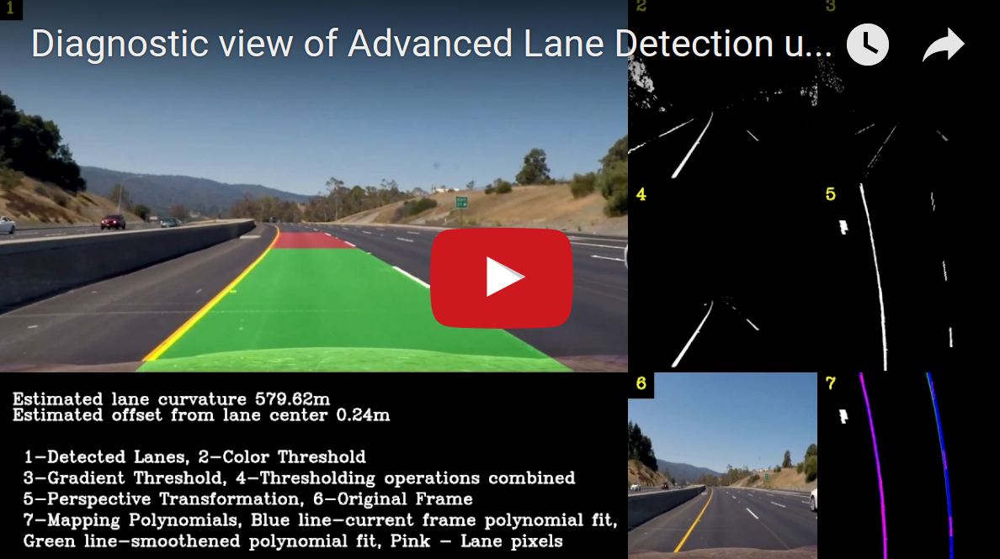
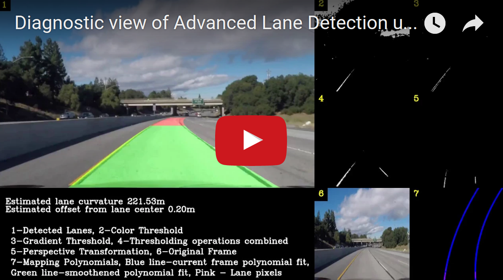
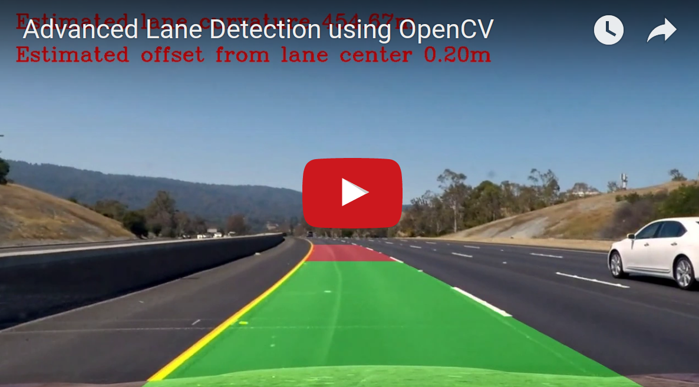
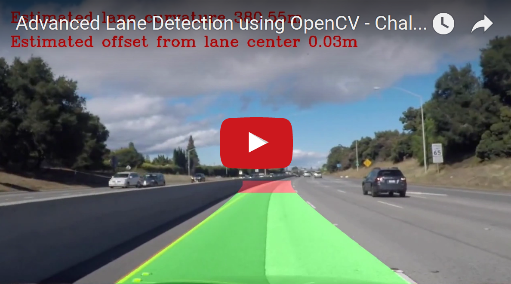

# Advanced Lane Finding Project

## In this project, the goal is to write a software pipeline to identify the lane boundaries in a video.

### The software pipeline consists of the following stages:

1. [Compute the camera calibration matrix and distortion coefficients given a set of chessboard images.](#1)
2. [Apply a distortion correction to raw images.](#2)
3. [Use color transforms and gradients to create a thresholded binary image.](#3)
4. [Apply a perspective transform to rectify binary image ("birds-eye view").](#4)
5. [Detect lane pixels and fit to find the lane boundary.](#5)
6. [Determine the curvature of the lane and vehicle position with respect to center.](#6)
7. [Warp the detected lane boundaries back onto the original image.](#7)
8. [Output visual display of the lane boundaries and numerical estimation of lane curvature and vehicle position in the video.](#8)

### Steps to run the project:

Open the **advanced_lane.ipynb** and run !!

### Now lets discuss each of these software pipeline stages in detail. 

## Camera Calibration Stage<a name="1"/>

Real cameras use curved lenses to form an image, and light rays often bend a little too much or too little at the edges of these lenses. This creates an effect that distorts the edges of images, so that lines or objects appear more or less curved than they actually are. This is called radial distortion, and it’s the most common type of distortion.

There are three coefficients needed to correct for radial distortion: k1, k2, and k3. To correct the appearance of radially distorted points in an image, one can use a correction formula mentioned below.

 

In the following equations, (x,y) is a point in a distorted image. To undistort these points, OpenCV calculates r, which is the known distance between a point in an undistorted (corrected) image (xcorrected ,ycorrected) and the center of the image distortion, which is often the center of that image (xc ,yc ). This center point (xc ,yc) is sometimes referred to as the distortion center. These points are pictured above.

The **do_calibration()** function performs the following operations:
1. Read chessboad images and convert to gray scale
2. Find the chessboard corners. 
    * I start by preparing **object points**, which will be the (x, y, z) coordinates of the chessboard corners in the world. Here I am assuming the chessboard is fixed on the (x, y) plane at z=0, such that the **object points** are the same for each calibration image. Thus, **objp** is just a replicated array of coordinates, and **objpoints** will be appended with a copy of it every time I successfully detect all chessboard corners in a test image. **imgpoints** will be appended with the (x, y) pixel position of each of the corners in the image plane with each successful chessboard detection. 
3. Performs the **cv2.calibrateCamera()** to compute the distortion co-efficients and camera matrix that we need to transform the 3d object points to 2d image points.  
4. Store the calibration values in the **camera_cal/camera_cal.p** file to use it later.

The **get_camera_calibration()** function is to read the calibration values from the **camera_cal/camera_cal.p** file.

## Distortion Correction Stage<a name="2"/>

Using the distortion co-efficients and camera matrix obtaine dfrom the camera calibration stage we undistort the images using the **cv2.undistort** function.

**A sample chessboard image and corresponding undistorted image is shown below:**

By perfoming the distortion correction we can see that the cheesboard lines appear to be parallel compared to the original raw image.

**Another sample image and corresponding undistorted image is shown below:**

We can see that the left car appears to be shifted left compared to the original raw image. 

## Creating a Thresholded binary image using color transforms and gradients<a name="3"/>

In the thresholding binary image stage, multiple transformations are applied and later combined to get the best binary image for lane detection.

The code for the thresholding operation are in the file named **thresholding_main.py**. In this file various thresholding operations are defined which are explained below. 

### Saturation thresholding: 
The images are transformed to HLS color space to obtain the saturation values, the **yellow color lanes** are best detected in the saturation color space. This thresholding operation is called in the **color_thr()** function. 

### Histogram equalized thresholding: 
The images are transformed to gray scale and histogram is equalized using the **cv2.equalizeHist()** function, the **white color lanes** are best detected using this. This thresholding operation is called in the **adp_thresh_grayscale()** function. 

### Gradient Thresholding: 
The **Sobel operator** is applied to get the gradients in the **x** and **y** direction which are also used to get the **magnitude** and **direction** thresholded images.
To explain these thresholding I use the below test image and apply the 4 thresholding operations.

* **Gradient thresholded in x-direction using Sobel operator** This thresholding operation is called in the **abs_sobel_thresh()** function. 

* **Gradient thresholded in y-direction using Sobel operator** This thresholding operation is called in the **abs_sobel_thresh()** function. 

* **Magnitude threshold of the Gradient** This thresholding operation is called in the **mag_thresh()** function. 

* **Direction threshold of the Gradient**  This thresholding operation is called in the **dir_threshold()** function. 

### Region of Interest: 
Masking to concentrate on the essential part of the image - the lanes. The **region_of_interest()** function is implemented in the **perspective_regionofint_main.py** file. 

The below figure shows the region of interest

### Combining the above thresholding step to get the best binary image for lane detection. 

To obtain the clear distinctive lanes in the binary image, threshold parameters for the above operation have to be fine tuned. This is the most critical part as the clear visible lanes are easier to detectt and fit a poly in future steps. **The fine tuning process is done by interactively varying the threshold values and checking the results as shown below.** Here the **Region of Interest** is also implemented to get the final binary image.

After finalizing the thresholding parameters, we proceed to the next pipeline stage - **Perspective transformation**.

## Perspective transformation: <a name="4"/>
A perspective transform maps the points in a given image to different, desired, image points with a new perspective. For this project, perspective transformation is applied to get a **bird’s-eye** view like transform, that let’s us view a lane from above; this will be useful for calculating the lane curvature later on.

The code for the perspective transformation is defined in the function **perspective_transform()** which is included in the file **perspective_regionofint_main.py**.
The source and destination points for the perspective transformation are in the following manner:

| Source        | Destination   |
| ------------- |:-------------:|
| **704,453**   | **960,0**     |
| **1280,720**  | **960,720**   |
| **0,720**     | **320,720**   |
| **576,453**  | **320,0**     |

**The following images shows the perspective transformation from source to destination.**

* Image 1 - Having parallel lanes.  

* Image 2 - Having curved lanes, here lanes appear parallel in normal view, but on perspective transformation we can clearly see that the lanes are curved.

## Detect lane pixels and fit to find the lane boundary.<a name="5"/>

After applying calibration, thresholding, and a perspective transform to a road image, we have a binary image where the lane lines stand out clearly as shown above. Next a polynomial curve is fitted to the lanes. This is defined in the function **for_sliding_window()** included in the file **sliding_main.py**

For this, I first take a histogram along all the columns in the lower half of the image. Th histogram plot is shown below.

With this histogram, I am adding up the pixel values along each column in the image. In my thresholded binary image, pixels are either 0 or 1, so the two most prominent peaks in this histogram will be good indicators of the x-position of the base of the lane lines. I use that as a starting point to search for the lines. From that point, I use a sliding window, placed around the line centers, to find and follow the lines up to the top of the frame. The sliding window technique can be shown as in the below image:

In the above image the sliding windows are shown in green, left lanes are red colored, right lanes are blue colored and the polynomial fits are yellow lines.

This pipeline when applied to the video frames gives lots of jittering between the frames. I have implemented the smoothing/average over 10 previous frames to get a jitter free lane lane detection. This average value polynomial fits of the previous frames are also used in senarios where the poly fits are not resonable in the current frame as shown in the figure below.

Here the green lines are the polynomial fit of the past 10 frames and the blue represents the polynomial fit for the current frame. The lane pixels are pink colored. It can be observed that the left and right lanes cross each other which is not a practical scenario, so a better judgement call here is to consider the averaged polynomial of the past frames in these cases.

## Determine the curvature of the lane and vehicle position with respect to center.<a name="6"/>
The **curvature of the lanes** f(y) are calculated by using the formulae R(curve)

The **vehicle position** is calculated as the difference between the image center and the lane center. It is shown in the below image as the offset from the center

## Warp the detected lane boundaries back onto the original image.<a name="7"/>

NOw we can wrap the detected lanes on the original images using inverse perspective transform. The below image shows the mapping of the polynomial fits on the original image. **The region between the lanes are colored green indicating higher confidence region. The region on the farthest end are colored red indicating that the lanes detected are low confidence region.**

## Debugging Tools

This project involves fine tuning of lot of parameters like color thresholding, gradient thresholding values to obtain the best lane detection. This can be tricker if the pipeline fails for few video frames. To efficiently debug this I had to build a frame that captures multiple stages of the pipeline, like the color transformation, gradient thresholding, line fitting on present and averaged past frames.

The viodeo of the diagnostic tool is shown below:

### Project Video diagnosis:

### Challenege Video diagnosis:

## Results <a name="8"/>

### The results of the pipeline applied on the project submission video and challenge video are shown below.

### Project Video:

### Challenege Video:

## Key Project Work Learnings and Future Work
* This project involves lot of hyper-parameters that need to be tuned properly to get the correct results. So use of tools like the varying hyperparameters to check the output was beneficial.
* The processing of this pipeline on my system is very time consuming, need to check the pipeline on high performance machines with GPU.
* The pipeline fails in low light conditions where the lanes are not visible. This was observed during the testing of the pipeline on Hard challege video.
* This project was based on conventional computer vision techniques, I would like to implement a solution the problem using techniques from machine learning. 
